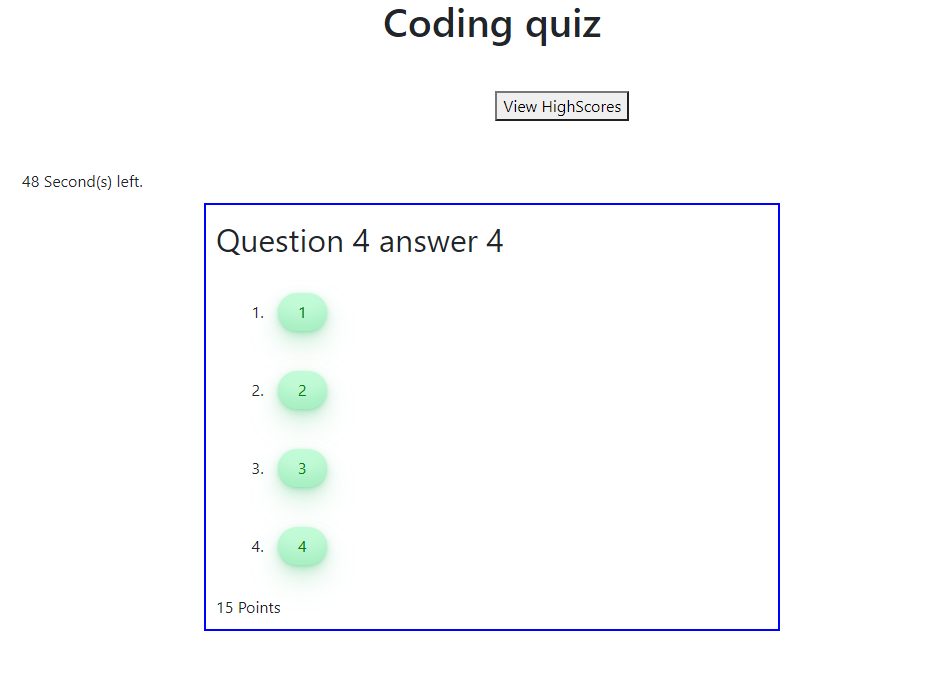
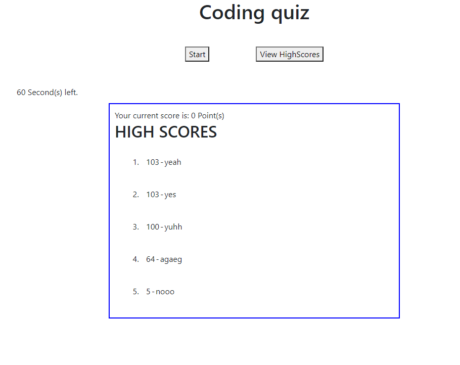

# Code-Quiz
This is a timed quiz about coding in general to help us prepare for any future interviews that will require some multiple choice questions.

Once start is pressed, user will get asked questions one at a time, up to 10 questions.

if wrong answer is chosen, timer is reduced by 8 seconds.

Game is over once all questions are answered or time has run out.

Total point is correct answers + time left.

At the end of the screen user will get asked for their name to show on the highscore leader board.

https://mkang987.github.io/Code-Quiz/